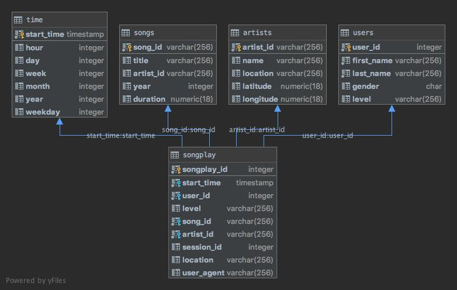

### Project Background

* Sparkify provides music streaming to end users. Data of song details and user activities is captured as JSON files.

* AWS Redshift is used as data warehouse solution, enabling persistent data storage and ad hoc interactive queries.  

* We choose star schema to link various pieces of the data assets: songplays as fact table, and users, songs, artists, and time as dimension tables.  

### Redshift Setup
 
* Create Redshift IAM role with S3FullAccess. 

* Create Redshift cluster.

* Note Redshift host address, database username, password, port number, and insert them into config file.

* Attach Redshift IAM role to the cluster. 

### Data Sources

* Song Dataset, with metadata about a song and the artist of that song.

* Log Dataset, with simulated app activity logs.

### Final Tables

* Songplay Fact Table 

* Users Dimension Table

* Songs Dimension Table

* Artists Dimension Table

* Time Dimension Table

### Table Schemas 

### ETL Scripts

* sql_queries.py: contains all PostgreSQL queries used in the project.

* create_tables.py: make connection to database, and create all staging and final tables used in the project.

* etl.py: load raw data from s3 to staging tables, and populate final tables with data from staging with necessary transformations. 

### Execution Steps

* first run `python create_tables.py`

* then run `python etl.py` 

## Sample Queries

* find top 5 songs played by male 

     `select s.title, count(s.title) from songs s join songplay sp on s.song_id = sp.song_id  join users u on u.user_id = sp.user_id where u.gender = 'M' group by s.title order by count(s.title) desc limit 5`

* find top 5 songs played on weekends

    `select s.title, count(s.title) from songs s join songplay sp on s.song_id = sp.song_id join time t on t.start_time = t.start_time where t.weekday = 0 or t.weekday = 6 group by s.title order by count(s.title) desc limit 5`
